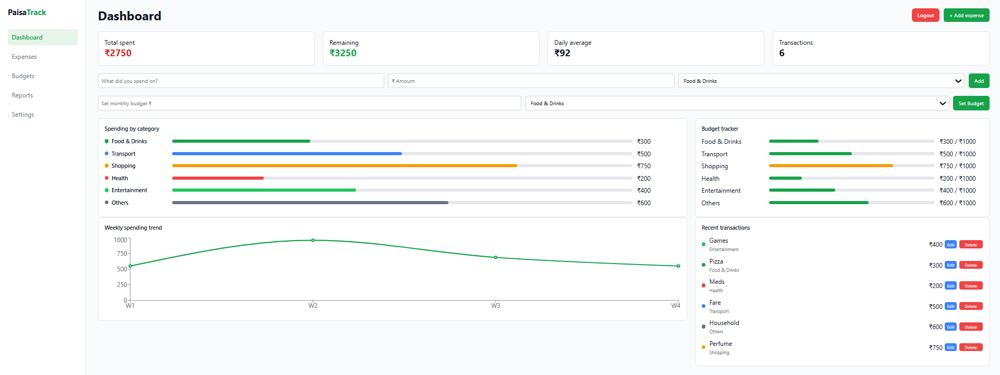
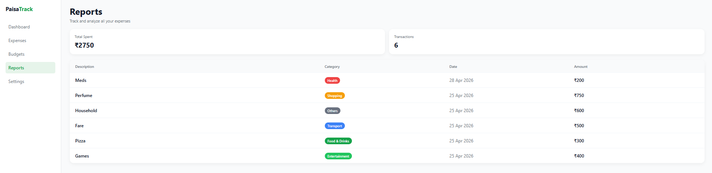
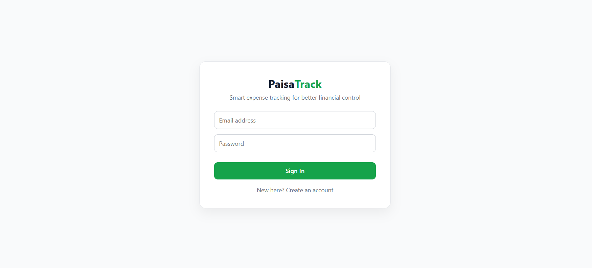
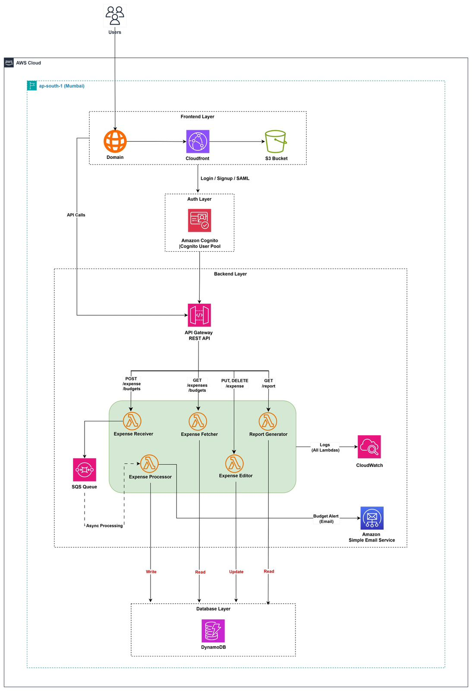

# 💰 PaisaTrack – Expense Management Application

PaisaTrack is a cloud-based expense tracking application designed to help users manage and analyze their daily expenses efficiently.  
The system is built using a serverless architecture on AWS, focusing on scalability, performance, and clean design.

---

## 🚀 Features

- 🔐 Secure authentication using Amazon Cognito 
- ➕ Add, edit, and delete expenses
- 📊 Category-based expense tracking
- 📈 Dynamic reports and insights
- ⚡ Real-time updates
- ⏳ Session timeout handling
- 📧 Budget alert notifications via email

---

## 🏗️ Architecture

The application follows a serverless microservices architecture on AWS:

### 🔹 Frontend Layer
- React application hosted on Amazon S3
- Delivered globally using Amazon CloudFront

### 🔹 Authentication Layer
- Managed using Amazon Cognito User Pools
- Supports secure login and Google authentication

### 🔹 Backend Layer
- Amazon API Gateway handles incoming requests
- Multiple AWS Lambda functions:
  - Expense Receiver (handles incoming requests)
  - Expense Fetcher (retrieves data)
  - Expense Editor (update/delete operations)
  - Report Generator (creates reports)

---

### 🔹 Core Processing Layer (Key Component)

- Expense Processor (Lambda) acts as the core logic engine of the system  
- Integrated with Amazon SQS for asynchronous processing  
- Handles:
  - Data validation and transformation  
  - Business logic execution  
  - Decoupling of write operations from processing  
- Improves system scalability and reliability by offloading heavy tasks from direct API calls  

---

### 🔹 Asynchronous Workflow

- Amazon SQS Queue receives events from Expense Receiver  
- Expense Processor Lambda consumes messages asynchronously  
- Ensures smooth performance even under load  

---

### 🔹 Monitoring & Alerts
- Amazon CloudWatch for logs and monitoring  
- Amazon SES for sending budget alert emails  

---

### 🔹 Database Layer
- Amazon DynamoDB for storing user data and expenses  

---

## ⚙️ Tech Stack

- React.js  
- AWS Lambda  
- API Gateway  
- DynamoDB  
- Amazon Cognito  
- CloudFront + S3  
- Amazon SQS  
- Amazon SES  
- CloudWatch  

---

## 🌐 Live Application

👉 [Your App URL]

---

## 📸 Screenshots

### Dashboard

### Reports

### Login

### Architecture

---

## 📂 Project Structure

frontend/ → React application  
backend/ → Lambda functions & API logic  
docs/ → Architecture diagram & screenshots  

---

## 📌 Key Learnings

- Designing scalable applications using serverless architecture  
- Implementing authentication and session management  
- Building REST APIs using API Gateway and Lambda  
- Handling asynchronous workflows using SQS  
- Designing decoupled systems using event-driven architecture  

